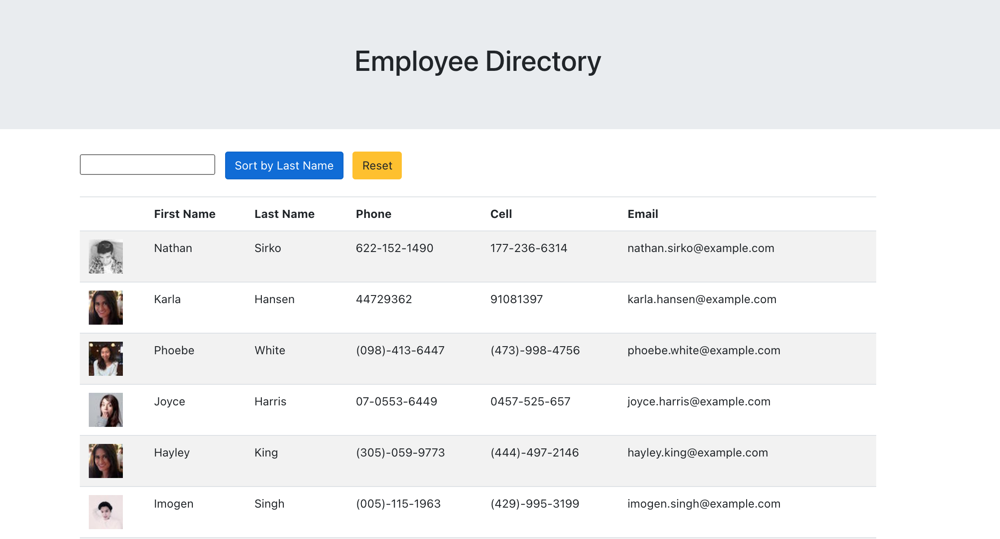

# employee-directory
  

## Description
This is an employee directory built using React.js. It allows users to filter and sort the employees by name.
  
## Table of Contents
1. [Installation](#Installation)
2. [Usage](#Usage)
3. [Technologies](#Technologies)
4. [Images](#Images)
5. [License](#License)
6. [Contact Information](#Questions)
  
## Installation
* fork or clone the repo 
* run `npm i` in the root folder 
* run `npm start` to launch the site in localhost

## Usage
Use this project to keep track of and lookup your employees. 

## Technologies
* Node.js
* React.js
* Bootstrap
* gh-pages
* axios

## Images

## License
This project is licensed under the MIT license.

## Questions
**Github:** [jesusefraingonzalez](https://github.com/jesusefraingonzalez)
  
Contact me at jesusgonzalez0797@gmail.com with any additional questions. 

